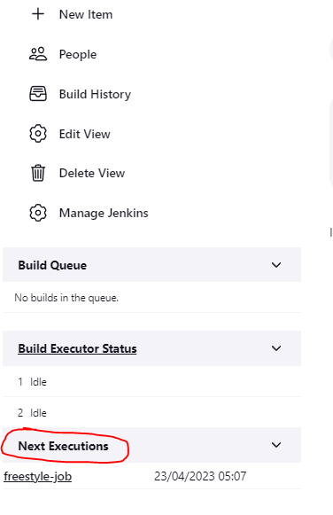
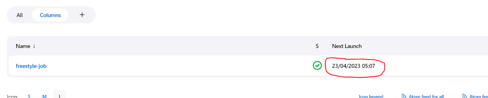
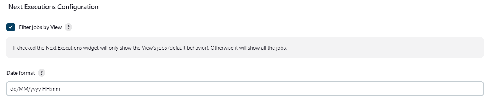

:toc:
:toc-placement!:

Adds a widget in the sidebar with the next _build_ date for all the
scheduled projects. It also creates a column definition.

toc::[]

image:https://ci.jenkins.io/job/Plugins/job/next-executions-plugin/job/main/badge/icon[Build Status]
image:https://img.shields.io/jenkins/plugin/v/next-executions.svg[Jenkins Plugin]
image:https://img.shields.io/github/release/jenkinsci/next-executions-plugin.svg?label=changelog[GitHub release]
image:https://img.shields.io/jenkins/plugin/i/next-executions.svg?color=blue[Jenkins Plugin Installs]

Screenshots
-----------

A picture's worth a thousand words.

Sidebar widget (main)
~~~~~~~~~~~~~~~~~~~~~

View Column
~~~~~~~~~~~

Configuration options
~~~~~~~~~~~~~~~~~~~~~

Changelog
---------

Releases are now published on GitHub releases

You can find bellow previous releases Changelog

Version 1.0.15 (2019-10-30)
~~~~~~~~~~~~~~~~~~~~~~~~~~~

* Some failed versions (unable to release them)  between this one and 1.0.12
* Build on ci.jenkins.io
* Migrated documentation from wiki to github
* Updated versions (core, parent, jdk)
* Fixed some spotbugs

Version 1.0.12 (2016-09-20)
~~~~~~~~~~~~~~~~~~~~~~~~~~~

* https://issues.jenkins-ci.org/browse/JENKINS-35476[JENKINS-35476]:
Show pipeline/workflow jobs
* https://issues.jenkins-ci.org/browse/JENKINS-30840[JENKINS-30840]:
added column type for possible next executions.
* https://issues.jenkins-ci.org/browse/JENKINS-36210[JENKINS-36210]:
expose widget data through API

Version 1.0.11 (2016-02-04)
~~~~~~~~~~~~~~~~~~~~~~~~~~~

* Fixes
https://issues.jenkins-ci.org/browse/JENKINS-32652[JENKINS-32652].
* Updated german translation

Version 1.0.10 (2015-02-01)
~~~~~~~~~~~~~~~~~~~~~~~~~~~

* Show items in the queue (only if they're gonna be there for more than
a minute). See, for example,
https://wiki.jenkins-ci.org/display/JENKINS/Schedule+Build+Plugin[Schedule
Build Plugin]).
* Fixed widget's different display modes in latest Jenkins versions.

Version 1.0.9 (2014-07-08)
~~~~~~~~~~~~~~~~~~~~~~~~~~

* https://issues.jenkins-ci.org/browse/JENKINS-16339[JENKINS-16339]
Jobname truncated in next-executions. Added 3 display modes to show the
job name in the widget.
1.  Truncate: truncate job name if too long.
2.  Fixed width: job name wraps to next line
3.  Jenkins: same as other regular Jenkins' widgets; widget expands
horizontally to show the job name.

Version 1.0.8 (2014-06-17)
~~~~~~~~~~~~~~~~~~~~~~~~~~

* https://issues.jenkins-ci.org/browse/JENKINS-23391[JENKINS-23391]
Widget don't collapse when "-" button is clicked.

Version 1.0.7 (2014-06-09)
~~~~~~~~~~~~~~~~~~~~~~~~~~

* Added German translation (thanks to
https://github.com/phoenix384[phoenix384]).
* https://issues.jenkins-ci.org/browse/JENKINS-23162[JENKINS-23162]
Added an optional widget to show the next polling for the SCM trigger.
To enable it, go to the global configuration page.

Version 1.0.6 (2014-02-10)
~~~~~~~~~~~~~~~~~~~~~~~~~~

* Added French translation (thanks to
https://github.com/damienfinck[damienfinck]).
* https://issues.jenkins-ci.org/browse/JENKINS-21267[JENKINS-21267]
Added tooltip to show remaining time until next execution.

Version 1.0.5 (2012-11-07)
~~~~~~~~~~~~~~~~~~~~~~~~~~

* Fixed
https://issues.jenkins-ci.org/browse/JENKINS-12676[JENKINS-12676]
(thanks to OHTAKE Tomohiro for the patch).
* Added a global configuration option to enable/disable filtering by
view in sidebar's widget.
* Added a Computer's widget. It shows the jobs tied to a computer.

Version 1.0.4 (2012-02-25)
~~~~~~~~~~~~~~~~~~~~~~~~~~

* Added a global configuration option to set the date format.

Version 1.0.3 (2012-01-13)
~~~~~~~~~~~~~~~~~~~~~~~~~~

* Added ja localization (Thanks to Tadanori Nakagawa).

Version 1.0.2 (2011-06-21)
~~~~~~~~~~~~~~~~~~~~~~~~~~

* Added column definition for the views.
* Shows only projects associated with the view.
* Disabled projects should not be shown.

Version 1.0.1 (2011-06-14)
~~~~~~~~~~~~~~~~~~~~~~~~~~

* Added tooltip to project name.
* Links to projects
* Changed date format to fit same width.
* Shorter project name on widget

Version 1.0.0 (2011-06-09)
~~~~~~~~~~~~~~~~~~~~~~~~~~

* Initial Release.
