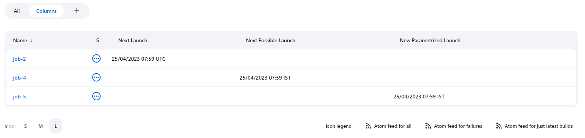

# Next executions plugin

Adds a widget in the sidebar with the next *build* date for all the
scheduled projects. It also creates a column definition.

## Screenshots

A picture’s worth a thousand words.

## Sidebar widget (main)

## View Column

## Configuration options

## Parameterized Scheduler Plugin

Recent version of the plugin support integration with
parameterized-scheduler-plugin.

Plugin need to be installed to display new widget and column.

Need to be enable via JCasC or under system configuration.

## JcasC support

    nextBuilds:
      dateFormat: 'dd/MM/yyyy HH:mm z'
      filterByView: false
      showPossibleWidget: false
      showParameterizedWidget: false

## Build plugin

    mvn clean install

## Run test instance

    mvn hpi:run -Dport=8080 -Dhost=0.0.0.0

# Changelog

Releases are now published on GitHub releases

You can find bellow previous releases Changelog

## Version 1.0.15 (2019-10-30)

-   Some failed versions (unable to release them) between this one and
    1.0.12

-   Build on ci.jenkins.io

-   Migrated documentation from wiki to github

-   Updated versions (core, parent, jdk)

-   Fixed some spotbugs

## Version 1.0.12 (2016-09-20)

-   [JENKINS-35476](https://issues.jenkins-ci.org/browse/JENKINS-35476):
    Show pipeline/workflow jobs

-   [JENKINS-30840](https://issues.jenkins-ci.org/browse/JENKINS-30840):
    added column type for possible next executions.

-   [JENKINS-36210](https://issues.jenkins-ci.org/browse/JENKINS-36210):
    expose widget data through API

## Version 1.0.11 (2016-02-04)

-   Fixes
    [JENKINS-32652](https://issues.jenkins-ci.org/browse/JENKINS-32652).

-   Updated german translation

## Version 1.0.10 (2015-02-01)

-   Show items in the queue (only if they’re gonna be there for more
    than a minute). See, for example, [Schedule Build
    Plugin](https://wiki.jenkins-ci.org/display/JENKINS/Schedule+Build+Plugin)).

-   Fixed widget’s different display modes in latest Jenkins versions.

## Version 1.0.9 (2014-07-08)

-   [JENKINS-16339](https://issues.jenkins-ci.org/browse/JENKINS-16339)
    Jobname truncated in next-executions. Added 3 display modes to show
    the job name in the widget.

    1.  Truncate: truncate job name if too long.

    2.  Fixed width: job name wraps to next line

    3.  Jenkins: same as other regular Jenkins' widgets; widget expands
        horizontally to show the job name.

## Version 1.0.8 (2014-06-17)

-   [JENKINS-23391](https://issues.jenkins-ci.org/browse/JENKINS-23391)
    Widget don’t collapse when "-" button is clicked.

## Version 1.0.7 (2014-06-09)

-   Added German translation (thanks to
    [phoenix384](https://github.com/phoenix384)).

-   [JENKINS-23162](https://issues.jenkins-ci.org/browse/JENKINS-23162)
    Added an optional widget to show the next polling for the SCM
    trigger. To enable it, go to the global configuration page.

## Version 1.0.6 (2014-02-10)

-   Added French translation (thanks to
    [damienfinck](https://github.com/damienfinck)).

-   [JENKINS-21267](https://issues.jenkins-ci.org/browse/JENKINS-21267)
    Added tooltip to show remaining time until next execution.

## Version 1.0.5 (2012-11-07)

-   Fixed
    [JENKINS-12676](https://issues.jenkins-ci.org/browse/JENKINS-12676)
    (thanks to OHTAKE Tomohiro for the patch).

-   Added a global configuration option to enable/disable filtering by
    view in sidebar’s widget.

-   Added a Computer’s widget. It shows the jobs tied to a computer.

## Version 1.0.4 (2012-02-25)

-   Added a global configuration option to set the date format.

## Version 1.0.3 (2012-01-13)

-   Added ja localization (Thanks to Tadanori Nakagawa).

## Version 1.0.2 (2011-06-21)

-   Added column definition for the views.

-   Shows only projects associated with the view.

-   Disabled projects should not be shown.

## Version 1.0.1 (2011-06-14)

-   Added tooltip to project name.

-   Links to projects

-   Changed date format to fit same width.

-   Shorter project name on widget

## Version 1.0.0 (2011-06-09)

-   Initial Release.

## Contributing

Refer to our [contribution guidelines](https://github.com/jenkinsci/.github/blob/master/CONTRIBUTING.md)

## LICENSE

Licensed under MIT, see [LICENSE](LICENSE.md)